# Azure Architecture Review Agent

## 1. Purpose

Azure Architecture Review Agent automates the first review of an Azure solution design.

The design remains in an existing Azure DevOps Wiki page. A designer creates an Azure Boards work item and adds the Wiki page URL to the work-item description. An Azure DevOps service hook calls an Azure Function, which reads the complete design and sends it to a Microsoft Foundry review agent. The agent retrieves relevant approved guidance from Azure AI Search, reviews the design, and returns findings and recommendations. The Function validates the result and writes a readable review back to the Azure Boards work item.

The automation writes to **Azure Boards only**. It never changes the Wiki page.

The agent provides a recommendation, not an approval. An authorized person must review the findings and record the final approval in Azure Boards before implementation begins.

## 2. What is deployed

The current development deployment uses the following known resources and configuration.

| Item | Current value | Purpose |
| --- | --- | --- |
| Azure subscription | `alz-nl-hq-s-ccoeadm-mpalani` | Hosts the development resources |
| Subscription ID | `f565124f-a0f3-4bde-b0e8-dcadc036868b` | Azure resource scope |
| Azure tenant ID | `7b81ccc5-ba35-4bf8-854f-49f9c02d3fb1` | Microsoft Entra tenant |
| Resource group | `rg-euw-nl-hq-s-sandbox` | Hosts the Function and related sandbox resources |
| Function App | `archdesignreview` | Receives the Board event and orchestrates the review |
| Function name | `architecture_review` | HTTP-triggered Python function |
| Function route | `/api/architecture-review` | Service-hook target path |
| Application Insights | `archdesignreview202609131507` | Function execution, dependency, trace, and exception telemetry |
| Foundry account | `mpalanisandbox` | Parent Microsoft Foundry resource |
| Foundry project | `firstProject` | Contains the review agent and project identity |
| Foundry project endpoint | `https://mpalanisandbox.services.ai.azure.com/api/projects/firstProject` | Endpoint used by the Function |
| Foundry agent | `architecture-review-agent` | Reviews the design and returns structured JSON |
| Azure AI Search service | `archdesignreview` | Hosts architecture guidance and the agent knowledge base |
| Search knowledge base | `architecture-review-knowledge` | Curated guidance available to the Foundry agent |
| Source branch | `dev_design_review` | Current development branch |

The exact storage account, snapshot container, Azure DevOps organization, and Azure DevOps project are supplied through Function App settings. The Foundry agent owns the Search knowledge connection and index configuration. Secret values are intentionally not documented here.

## 3. Simple end-to-end flow

```mermaid
flowchart LR
    A[Architect updates existing Wiki design] --> B[Architect creates or updates Board review item]
    B --> C[Board item contains the Wiki URL]
    C --> D[Azure DevOps service hook]
    D --> E[Azure Function: archdesignreview]
    E --> F[Read exact Wiki page and revision]
    F --> H[Build bounded review package]
    H --> I[Save input snapshot when configured]
    H --> J[Foundry architecture-review-agent]
    J --> G[Retrieve targeted guidance from Azure AI Search]
    G --> J
    J --> K[Structured review JSON]
    K --> L[Function validates response]
    L --> M[Save result snapshot when configured]
    L --> N[Format readable HTML]
    N --> O[Write review to Azure Boards only]
    O --> P[Architect manually updates Wiki if needed]
    P --> Q[Human approval decision in Boards]
```



In simple words:

1. The architect updates the existing design page in Azure DevOps Wiki.
2. The architect creates a Board work item and places the design page URL in its description.
3. A Board work-item event calls the Azure Function.
4. The Function finds the work-item ID and Wiki URL in the event.
5. The Function reads the exact Wiki page and records its revision.
6. The Function sends the complete design and explicit retrieval requirements to the Foundry agent.
7. The agent reviews the complete design and runs focused Azure AI Search queries for each applicable review domain.
8. The agent returns a structured, evidence-based review.
9. The Function rejects malformed output instead of writing an incomplete result.
10. The Function converts a valid result into readable HTML.
11. The Function adds the result to the Azure Boards work-item history.
12. The Function and agent do not edit the Wiki.
13. The architect addresses findings by manually updating the Wiki and submitting a new review.
14. A human approver makes the final decision.

## 4. Component responsibilities

### 4.1 Azure DevOps Wiki

The Wiki is the authoritative source for:

- Business and functional requirements
- Non-functional requirements, including availability, CIA, RPO, and RTO
- Architecture decisions and assumptions
- Mermaid or other architecture diagrams
- Networking, identity, security, data, integration, and operations design
- Cost and sizing assumptions

The automation has read-only behavior toward the Wiki. Findings are not written to the Wiki.

### 4.2 Azure Boards

Azure Boards is the authoritative source for:

- Review request and owner
- Link to the Wiki design
- Review state
- Agent findings and recommendation
- Human comments and remediation evidence
- Final human approval

A Board item may contain only the Wiki URL in its description, provided the URL points to the actual design page and the page contains content.

### 4.3 Azure DevOps service hook

The service hook starts the workflow when the configured Board event occurs.

Recommended configuration:

- Publisher: Azure Boards
- Event: Work item updated
- Area path: The target project or architecture-review area
- Work item type: The design-review work-item type, such as `Product Backlog Item`
- Tag: `design review`
- Field: `Tags`
- Consumer: Web Hooks
- URL: Function URL for `/api/architecture-review`
- Authentication: Function key or an equivalent authenticated gateway

This setup triggers only when tags change on a matching PBI that contains `design review`. The Function then verifies that `design review` was newly added: it must be absent from `System.Tags.oldValue` and present in `System.Tags.newValue`. Tag removal and unrelated tag edits return HTTP `200` with `status: ignored`. The Function's Board history update does not change tags, so it does not trigger the webhook.

### 4.3.1 Add another Azure DevOps project

To onboard another project to the same Function:

1. Confirm the project uses the same Azure DevOps organization configured in `AZURE_DEVOPS_ORG_URL`.
2. Add the exact project name to the comma-separated `AZURE_DEVOPS_ALLOWED_PROJECTS` Function setting.
3. Ensure the PAT/service identity can read Wiki pages and read/write work items in that project.
4. Ensure the team uses the tag `design review` consistently.
5. In the new project, open **Project settings -> Service hooks** and create a **Web Hooks** subscription.
6. Select **Work item updated**, the required area path/work-item type, **Tag = design review**, and **Field = Tags**.
7. Configure the existing Function endpoint and Function key.
8. Test by adding `design review` to a work item that did not already have that tag. The description must contain a Wiki URL from an approved project.

For `https://shv-energy.visualstudio.com/NL_HQ_T_Cloud_CoE`, the exact project allowlist value is `NL_HQ_T_Cloud_CoE`.

### 4.4 Azure Function

The implementation is in `function-app/function_app.py`.

The Function:

- Uses function-level HTTP authentication
- Parses common Azure DevOps service-hook payload shapes
- Requires an event ID, work-item ID, and valid Azure DevOps Wiki URL
- Supports Wiki URLs containing either a page path or a numeric page ID
- Reads Wiki content through the Azure DevOps REST API
- Detects every embedded Azure DevOps Wiki PNG attachment and downloads the actual image from the Wiki Git repository
- Sends the complete Wiki text and PNG diagrams to the Foundry agent as high-detail vision inputs
- Captures the Wiki `ETag` as the source revision
- Builds a bounded review package
- Tells the agent to use its configured knowledge tool for focused searches across all review domains
- Saves input and output snapshots when Blob Storage is configured
- Invokes the named Foundry agent
- Validates the returned JSON with strict Pydantic models
- Requires one named diagram assessment for every supplied PNG
- Escapes agent content before producing HTML
- Adds the HTML result to `System.History` on the Board item
- Logs a correlation ID and the major processing stages

The Function returns:

| HTTP status | Meaning |
| --- | --- |
| `200` | Review completed and the Board item was updated |
| `200` with `status: ignored` | Valid webhook delivery that did not transition into the configured review state |
| `400` | Invalid event, missing Wiki URL/content, or invalid agent output |
| `401` or `403` | Authentication or authorization failure at the Function or a dependency |
| `502` | Azure DevOps or another HTTP dependency failed |
| `500` | Unexpected Function or SDK failure |

### 4.5 Azure AI Search

The Search service provides stable, curated architecture guidance. The repository sources are under `knowledge-base/reference`.

Examples include:

- CAF validation checklist
- WAF validation checklist
- Azure architecture principles
- Architecture-review instructions
- Design and workload templates
- Review and approval flow

The live Wiki design must not be copied into this static knowledge base. The Function retrieves the current Wiki revision for every review.

The Foundry agent owns guidance retrieval. It first reads the complete design and then uses its configured Search knowledge/MCP connection to run focused searches across architecture, security, identity, networking, reliability, operations, governance, and cost. This avoids choosing guidance from only the beginning of the document.

### 4.6 Microsoft Foundry agent

The Function invokes `architecture-review-agent` in the existing `firstProject` project.

The agent checks the design against:

- Cloud Adoption Framework
- Well-Architected Framework
- Security and identity practices
- Reliability and disaster recovery
- Networking and private connectivity
- Governance, policy, naming, and tagging
- Cost and sizing
- Operational ownership and monitoring

The agent must return JSON matching the Function contract:

```json
{
  "reviewId": "string",
  "sourceRevision": "string",
  "summary": "string",
  "overallRisk": "Critical|High|Medium|Low",
  "recommendation": "Approved|Approved with Conditions|Changes Required|Rejected",
  "findings": [
    {
      "id": "SEC-001",
      "title": "Short finding title",
      "severity": "Critical|High|Medium|Low",
      "category": "Security",
      "description": "What was found",
      "impact": "Why it matters",
      "recommendation": "What should change",
      "evidence": ["Design section or Microsoft guidance"]
    }
  ],
  "missingInformation": ["Information still required"],
  "assumptions": ["Assumption used during the review"]
}
```

Extra or malformed fields are rejected. This prevents success-shaped but unusable Board updates.

### 4.7 Blob Storage snapshots

When snapshot storage is configured, the Function writes:

```text
<event-id>/input.json
<event-id>/result.json
```

The input snapshot contains the normalized design package. The result snapshot contains the validated agent response. These files support traceability and replay.

If the storage endpoint or container is not configured, the Function logs that snapshot storage was skipped and continues.

Do not place PATs, access tokens, connection strings, or other secrets in snapshots.

### 4.8 Application Insights

The Function sends telemetry to `archdesignreview202609131507`.

It records:

- Function requests and status codes
- Processing-stage traces
- Dependency calls
- Exceptions
- Correlation IDs
- Review start and completion messages

The Function App name and Application Insights name are different. For this deployment, open `archdesignreview202609131507`, not a similarly named component, when checking historical Function telemetry.

## 5. Function App configuration

The Function uses these application settings.

| Setting | Required | Purpose | Sensitive |
| --- | --- | --- | --- |
| `AzureWebJobsStorage` | Yes | Azure Functions runtime storage | Yes |
| `FUNCTIONS_WORKER_RUNTIME` | Yes | Must be `python` | No |
| `APPLICATIONINSIGHTS_CONNECTION_STRING` | Yes for monitoring | Sends telemetry to Application Insights | Yes |
| `AZURE_DEVOPS_ORG_URL` | Yes | Azure DevOps organization URL | No |
| `AZURE_DEVOPS_ALLOWED_PROJECTS` | Yes | Comma-separated list of projects allowed for Wiki reads and Board writeback | No |
| `REVIEW_TRIGGER_TAG` | Yes | Newly added tag that starts a review; use `design review` | No |
| `REVIEW_IDEMPOTENCY_CONTAINER` | Yes | Blob container for atomic Azure DevOps event claims; use `architecture-review-events` | No |
| `AZURE_DEVOPS_PAT` | Yes in current implementation | Reads Wiki and updates Board history | Yes |
| `AZURE_STORAGE_BLOB_ENDPOINT` | Optional | Snapshot storage account endpoint | No |
| `REVIEW_SNAPSHOT_CONTAINER` | Optional | Input/output snapshot container | No |
| `AZURE_AI_PROJECT_ENDPOINT` | Yes | Foundry project endpoint | No |
| `FOUNDRY_AGENT_NAME` | Yes | Agent to invoke | No |

Current Foundry values:

```text
AZURE_AI_PROJECT_ENDPOINT=https://mpalanisandbox.services.ai.azure.com/api/projects/firstProject
FOUNDRY_AGENT_NAME=architecture-review-agent
```

Do not put a real PAT in source control or `local.settings.example.json`. The current code reads `AZURE_DEVOPS_PAT` from the environment. In Azure, use a Key Vault reference for this setting where supported, and rotate the PAT according to organizational policy.

## 6. Authentication and RBAC

There are two authorization systems:

1. Azure RBAC for Azure resources
2. Azure DevOps permissions for Wiki and Boards

### 6.1 Azure managed identities

| Identity | Object ID | Used for |
| --- | --- | --- |
| Function App managed identity | `761e98ac-6ff5-42b6-85c2-ebd397739c99` | Foundry invocation and Blob snapshot access from the Function |
| Foundry account managed identity | `0dc96d32-3ce8-45d4-914e-a0580ec53749` | Foundry service access to Search |
| Foundry project managed identity | `becd02ce-f483-4423-bf76-1da69d839c60` | Agent/project access to the Search knowledge base |
| Agent identity blueprint principal | `711681c5-9fa7-4c7c-9ef4-437934358cd3` | Agent blueprint identity; it cannot currently receive normal Azure RBAC assignments directly |

### 6.2 Verified Azure role assignments

| Principal | Resource/scope | Role | Reason |
| --- | --- | --- | --- |
| Function managed identity | Foundry account `mpalanisandbox` | `Foundry User` | Invoke the agent in the Foundry project |
| Function managed identity | Azure ML workspace `firstplatformproject` | `AzureML Data Scientist` | Legacy/SDK access granted during troubleshooting; review whether it remains necessary |
| Function managed identity | Search service `archdesignreview` | Search roles granted during earlier troubleshooting | No longer required by the Function code; remove after confirming the agent-only retrieval path in the target environment |
| Foundry account identity | Search service `archdesignreview` | `Search Index Data Reader` | Read knowledge content |
| Foundry account identity | Search service `archdesignreview` | `Search Index Data Contributor` | Supports the configured Search knowledge/MCP workflow |
| Foundry account identity | Search service `archdesignreview` | `Search Service Contributor` | Supports the configured Search knowledge/MCP workflow |
| Foundry project identity | Search service `archdesignreview` | `Search Index Data Reader` | Read knowledge content |
| Foundry project identity | Search service `archdesignreview` | `Search Index Data Contributor` | Required by the configured Search knowledge/MCP workflow |
| Foundry project identity | Search service `archdesignreview` | `Search Service Contributor` | Required by the configured Search knowledge/MCP workflow |

The agent identity blueprint principal returned `PrincipalTypeNotSupported` when Azure RBAC assignment was attempted. The effective Search permissions were therefore assigned to the Foundry project managed identity.

For production, review the broad Search contributor roles and reduce them when Microsoft Foundry and the configured knowledge-base operation can work with narrower data-plane permissions.

When snapshot storage is enabled, the Function managed identity also requires `Storage Blob Data Contributor` on the narrowest practical storage account or container scope. Verify this assignment against the selected snapshot storage resource because that resource is environment-specific.

### 6.3 Azure DevOps permissions

The current implementation uses a PAT through `AZURE_DEVOPS_PAT`. The PAT owner or service identity needs only:

- Wiki: read
- Work items: read and write
- Project: read enough to resolve the Wiki and work item

It does not need:

- Repository code write
- Pipeline execution
- Wiki write
- Project administration

Recommended PAT scopes:

- `vso.wiki` or the minimum Wiki read scope available in the organization
- `vso.work_write` for adding Board history

Use a dedicated service identity rather than a personal account for production.

## 7. Data and security boundaries

- The Wiki remains the source of truth for the design.
- The Board remains the source of truth for review state and approval.
- Automation writes to the Board only.
- The agent does not approve or deploy resources.
- The Function sends only the required design content and approved guidance to Foundry.
- Access tokens are added only to outbound Azure DevOps HTTP authorization headers.
- Secrets must not be logged or included in snapshots.
- Agent output is treated as untrusted until schema validation succeeds.
- HTML written to Boards is escaped to prevent injected markup.
- Critical findings cannot be converted automatically into approval.

## 8. Demo preparation

### 8.1 Before the demo

1. Confirm that the `archdesignreview` Function App is running.
2. Confirm that each approved Azure DevOps project has a service hook with event `Work item updated`, tag `design review`, and field `Tags`.
3. Confirm `REVIEW_TRIGGER_TAG` is `design review`; tag removals and unrelated tag changes are ignored by the Function.
4. Open the `architecture-review-agent` in Foundry.
5. Confirm that its model and Search knowledge connection are healthy.
6. Open Application Insights `archdesignreview202609131507`.
7. Prepare a Wiki design page that contains enough architecture detail.
8. Prepare a new Board item, but do not save the trigger change until the demo.
9. Keep the Wiki page, Board item, Function App, Foundry project, and Application Insights open in separate tabs.
10. Do not display Function settings, PAT values, connection strings, or Function keys.

### 8.2 Suggested live demo

1. Show the design in Azure DevOps Wiki.
2. Explain that the Wiki is read-only to the automation.
3. Create or update the architecture-review Board item.
4. Paste the Wiki page URL into the description.
5. Save or move the item to the configured trigger state.
6. Open the service-hook history and show the successful delivery.
7. Open the Function monitor or Application Insights and show the invocation.
8. In Foundry, show the architecture-review agent and its knowledge connection.
9. Return to the Board item and refresh it.
10. Open the new history entry and show:
    - Overall risk
    - Recommendation
    - Summary
    - Findings table
    - Detailed findings
    - Missing information
    - Assumptions
11. Explain that the architect must manually update the Wiki.
12. Explain that only a human can approve implementation.

### 8.3 What success looks like

- Service hook delivery returns HTTP `200`.
- Function logs contain `Architecture review completed`.
- A snapshot exists when snapshot storage is enabled.
- A new readable history entry appears on the correct Board item.
- The Wiki page has not changed.
- The Board item still requires human review and approval.

## 9. Troubleshooting guide

Use the following order. Start at the trigger and follow the request through each dependency.

### 9.1 Azure DevOps service-hook logs

Portal path:

```text
Azure DevOps -> Project settings -> Service hooks -> History
```

Check:

- Was the event generated?
- Did the event match the filters?
- Which Function URL was called?
- What HTTP status was returned?
- Does the request body contain an event ID, work-item ID, and Wiki URL?

Common results:

| Result | Likely cause |
| --- | --- |
| No delivery | Event/filter configuration does not match the work item |
| `401` or `403` | Missing/invalid Function key or gateway authorization |
| `400` | Event payload or Wiki URL is invalid |
| `502` | Function reached an external HTTP dependency that failed |
| Two deliveries | Hook is too broad or the Function's Board write triggered another event |

### 9.2 Function live logs

Portal path:

```text
Azure portal -> Function App archdesignreview
-> Functions -> architecture_review -> Monitor
```

For a live demonstration, **Log stream** can show current logs. For historical investigation, use Application Insights.

Useful Function messages:

```text
Architecture review started correlation_id=...
Parsed request: work_item_id=... wiki_url=...
Fetching wiki: project=... wiki_id=... page_id=... path=...
Wiki document fetched: revision=... length=...
Architecture review completed correlation_id=... review_id=...
```

### 9.3 Application Insights logs

Portal path:

```text
Azure portal -> Application Insights archdesignreview202609131507 -> Logs
```

Recent Function requests:

```kusto
requests
| where timestamp > ago(24h)
| where cloud_RoleName =~ "archdesignreview"
| project timestamp, name, resultCode, success, duration, operation_Id
| order by timestamp desc
```

Function processing traces:

```kusto
traces
| where timestamp > ago(24h)
| where message has_any (
    "Architecture review",
    "Parsed request",
    "Fetching wiki",
    "Wiki document fetched",
    "Guidance search"
)
| project timestamp, severityLevel, message, operation_Id
| order by timestamp desc
```

Exceptions:

```kusto
exceptions
| where timestamp > ago(24h)
| project timestamp, type, outerMessage, innermostMessage, operation_Id
| order by timestamp desc
```

Dependency failures:

```kusto
dependencies
| where timestamp > ago(24h)
| where success == false
| project timestamp, name, target, resultCode, duration, data, operation_Id
| order by timestamp desc
```

Follow one invocation across tables:

```kusto
union requests, traces, dependencies, exceptions
| where operation_Id == "<operation-id>"
| order by timestamp asc
```

If logs are missing:

1. Open Function App **Diagnose and solve problems**.
2. Run **Function Configuration Checks**.
3. Verify `APPLICATIONINSIGHTS_CONNECTION_STRING` is present.
4. Verify the Function and Application Insights resources are linked.
5. Allow a few minutes for ingestion.

Official guidance:

- [Monitor Azure Functions](https://learn.microsoft.com/azure/azure-functions/functions-monitoring)
- [Analyze Azure Functions telemetry in Application Insights](https://learn.microsoft.com/azure/azure-functions/analyze-telemetry-data)

### 9.4 Azure DevOps Wiki/API failures

Symptoms:

- `404` from Wiki API
- `The Wiki page has no content`
- `The event must include a valid Azure DevOps Wiki URL`

Checks:

1. Open the URL from the Board description.
2. Confirm it points to the actual design page, not a parent or landing page.
3. Confirm the page has content.
4. Confirm the PAT can read the Wiki.
5. Confirm `AZURE_DEVOPS_ORG_URL` matches the organization and the Wiki project is listed in `AZURE_DEVOPS_ALLOWED_PROJECTS`.
6. In Function traces, check parsed `wiki_id`, `page_id`, and `path`.

The code supports URLs shaped like:

```text
https://dev.azure.com/<org>/<project>/_wiki/wikis/<wiki-name>.wiki/<page-id>/<page-title>
```

### 9.5 Microsoft Foundry agent logs

Foundry portal path:

```text
Microsoft Foundry -> mpalanisandbox -> firstProject
-> Agents -> architecture-review-agent
```

Check:

- Agent exists with the expected name
- Correct model deployment is selected
- Agent version/instructions are the intended version
- Search knowledge/MCP tool is connected
- Latest run contains tool calls and a final response
- Final response is valid JSON

For traces:

```text
Microsoft Foundry -> firstProject -> Observability/Tracing
```

Open the matching agent run and inspect:

- Input size and content boundaries
- Model response
- Tool calls
- Search/MCP status
- Token use and latency
- Authentication or permission errors

Typical errors:

| Error | Meaning | Action |
| --- | --- | --- |
| `403` invoking agent | Function identity lacks Foundry access | Verify `Foundry User` and project access |
| Missing `api-version` | Wrong client invocation pattern or endpoint | Verify current SDK pattern and project endpoint |
| `404` from Foundry | Wrong project endpoint or agent name | Verify `AZURE_AI_PROJECT_ENDPOINT` and `FOUNDRY_AGENT_NAME` |
| Agent returned no text | Model/agent run failed before final output | Inspect Foundry run and tool traces |
| Invalid review JSON | Agent output did not match contract | Check instructions and raw agent response |

Official guidance:

- [Trace agents in Microsoft Foundry](https://learn.microsoft.com/azure/ai-foundry/how-to/develop/trace-application)
- [Monitor Foundry agents](https://learn.microsoft.com/azure/ai-foundry/agents/how-to/metrics)

### 9.6 Azure AI Search logs

Portal paths:

```text
Azure portal -> Search service archdesignreview
-> Search management -> Indexes
```

and:

```text
Azure portal -> Search service archdesignreview
-> Monitoring -> Diagnostic settings
```

Check:

- Configured index exists
- Index has documents
- Query works in Search Explorer
- Search endpoint and index setting names are correct
- Function and Foundry project identities have required roles
- Knowledge-base/MCP connection targets the correct Search service

Enable diagnostic settings to a Log Analytics workspace for historical query and indexing diagnostics. Azure AI Search does not record the caller identity in its data-plane diagnostic logs, so use Function and Foundry traces for caller correlation.

Official guidance:

- [Configure diagnostic logging for Azure AI Search](https://learn.microsoft.com/azure/search/search-monitor-enable-logging)
- [Monitor Azure AI Search](https://learn.microsoft.com/azure/search/search-monitor-logs)

### 9.7 Snapshot storage

Portal path:

```text
Azure portal -> Storage account -> Data storage -> Containers
-> <REVIEW_SNAPSHOT_CONTAINER> -> <event-id>
```

Expected files:

```text
input.json
result.json
```

If files are missing:

1. Check `AZURE_STORAGE_BLOB_ENDPOINT`.
2. Check `REVIEW_SNAPSHOT_CONTAINER`.
3. Confirm the container exists.
4. Confirm the Function identity has `Storage Blob Data Contributor`.
5. Search Function traces for `Snapshot storage is not configured`.

### 9.8 Board writeback failures

Symptoms:

- Review completes in Foundry but no Board history entry appears
- Azure DevOps PATCH returns `401`, `403`, or `404`

Checks:

1. Confirm the work-item ID is correct.
2. Confirm the Wiki URL's project is listed in `AZURE_DEVOPS_ALLOWED_PROJECTS` and contains the work item.
3. Confirm the PAT has work-item write permission.
4. Confirm the PAT has not expired.
5. Check Function dependency logs for the Azure DevOps PATCH result.
6. Confirm the Board item is not locked by process rules.

### 9.9 Duplicate reviews

Current controls:

- The service hook requires the `design review` tag and filters updates to the `Tags` field.
- The Function accepts only the event that newly adds `REVIEW_TRIGGER_TAG`.
- A history-only update does not change tags and therefore does not trigger the service hook.
- The Function atomically stores a SHA-256-keyed event claim in the existing Function host storage before Wiki retrieval.
- Concurrent or later delivery of the same Azure DevOps event ID returns HTTP `200` with `status: ignored`.
- A processing claim becomes recoverable after ten minutes so a worker termination cannot suppress the event forever.
- A failure before Board writeback releases its claim so Azure DevOps can retry it. A successful review retains a completed claim.
- An uncertain Board write failure retains a failure marker, preventing an automatic retry from creating a second comment.

## 10. Known limitations and follow-up work

1. The Azure DevOps integration currently uses a PAT rather than workload identity.
2. The PAT should be supplied through a Key Vault reference in Azure.
3. Search roles on the Function identity should be removed after the agent-only retrieval path is verified; contributor roles on Foundry identities should be reviewed for least privilege.
4. Vision review currently supports embedded PNG attachments only, with a maximum of 10 images, 15 MB per image, and 50 MB total.
5. Snapshot storage is optional and silently skipped with an informational log when not configured. Image bytes are sent to Foundry but are not included in the JSON snapshots.
6. The quality of guidance retrieval now depends on the agent's Search knowledge/MCP connection and its compliance with the retrieval requirements in the review package.
7. A direct Azure DevOps MCP tool is available in Foundry, but the Function still reads the Wiki and writes the Board through Azure DevOps REST APIs. MCP adoption should be a controlled future change, not assumed current behavior.

## 11. Repository structure

| Path | Purpose |
| --- | --- |
| `.github/copilot-instructions.md` | Governance and review rules |
| `function-app/function_app.py` | Function orchestration implementation |
| `function-app/local.settings.example.json` | Safe local setting names and placeholders |
| `function-app/requirements.txt` | Python dependencies |
| `knowledge-base/reference` | Curated Search/agent guidance |
| `docs/markdown/design-review-approval-flow.md` | Detailed target review lifecycle |
| `docs/diagrams/design-review-approval-flow.mmd` | Mermaid source diagram |
| `templates` | Workload, design, CAF, and WAF templates |

## 12. Local development

1. Copy `function-app/local.settings.example.json` to `function-app/local.settings.json`.
2. Replace placeholders with local development values.
3. Never commit `local.settings.json`.
4. Create a Python virtual environment.
5. Install `function-app/requirements.txt`.
6. Start the Function with Azure Functions Core Tools.
7. Send a representative Azure DevOps event to the local Function.
8. Use a non-production Board item for writeback testing.

## 13. Governance rules

- The agent recommends; a human approves.
- Designs with Critical findings cannot be approved.
- Implementation remains blocked until approval is recorded in Azure Boards.
- The Wiki must be updated manually by the architect.
- Automation writes findings to the Board only.
- Do not expose secrets or tokens to the agent.
- Store non-sensitive evidence with correlation IDs.
- Keep the source revision with every result.
- Re-review the updated Wiki revision after remediation.

## 14. Demo summary

The shortest explanation for the audience is:

> The architect keeps the design in Azure DevOps Wiki and submits its link through Azure Boards. A service hook calls an Azure Function, which reads the complete design and sends it to a Microsoft Foundry agent. The agent retrieves targeted approved guidance from Azure AI Search, reviews the design, and returns findings and recommendations. The Function validates and formats the result, then writes it back to the Board only. The architect updates the Wiki manually, and a human approver makes the final decision.
