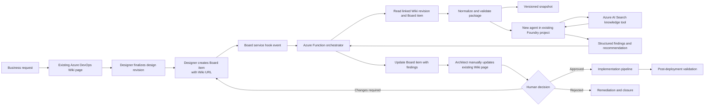

# Design Review and Approval Flow

## Purpose

This document defines the target flow for reviewing Azure solution designs. The organization already has an Azure DevOps organization, project, and Wiki. The designer updates the existing design page, then creates an Azure Boards review item containing the Wiki link. That Board event starts the review orchestration.

An Azure Function retrieves the exact Wiki revision and linked artifacts, then sends a controlled review package to a new architecture-review agent in the existing Microsoft Foundry project. The agent produces a structured architecture review. The orchestration layer writes findings and the recommendation to the linked Azure Boards item only. It does not edit the Wiki. The architect manually updates the existing Wiki page and resubmits it for another review cycle. Implementation starts only after the approval decision is recorded.

## End-to-end flow



The source Mermaid diagram is [../diagrams/design-review-approval-flow.mmd](../diagrams/design-review-approval-flow.mmd).

## System responsibilities

| Component | Responsibility |
| --- | --- |
| Existing Azure DevOps Wiki | Authoritative location for the design draft, diagrams, decisions, and assumptions. The architect manually updates the existing page. Automation must not edit the design page or write findings to it. |
| Existing Azure Boards project | Tracks review state, owner, due dates, findings, approvals, and the link to the Wiki design page. The designer creates the review item after finalizing the design revision. |
| Azure DevOps Service Hook | Emits the Board-item-created or submitted event that starts the review. A Wiki edit alone does not start a review. |
| Azure Function | Authenticates the event, reads the source documents and embedded Wiki PNGs, validates and normalizes the review package, invokes Foundry with text and high-detail vision inputs, validates the response, and updates the Board. It does not edit the Wiki. |
| Blob Storage | Keeps immutable, versioned input and output snapshots for traceability and replay. |
| Existing Microsoft Foundry project and new review agent | The Foundry project already exists. A dedicated architecture-review agent reads the complete design, runs focused queries through its configured Azure AI Search knowledge tool, and produces structured findings against CAF, WAF, Azure principles, security, reliability, cost, governance, and operations. |
| Azure AI Search | Stores curated guidance. The Foundry agent, not the Function, retrieves relevant guidance after reviewing the complete design. |
| Application Insights | Captures correlation IDs, timing, failures, review status, and non-sensitive audit metadata. |
| Entra ID and managed identities | Provides workload authentication and least-privilege access to Azure resources. |
| Key Vault | Stores secrets that cannot use managed identity, such as Azure DevOps integration credentials or certificates. |
| Implementation pipeline | Runs only after the Board contains an approved decision and the required evidence is present. |

## Review lifecycle

1. **Draft**: The requester and architect write or update the design on the existing Azure DevOps Wiki page.
2. **Ready for review**: The designer finishes a revision and creates a linked Board item containing the Wiki URL, page path, owner, scope, and requested review date.
3. **In review**: The Board service hook starts the Function. The Function retrieves the exact Wiki revision and every embedded PNG attachment.
4. **Normalized**: The Function validates required fields, removes unsupported content, records the source revision, and creates a versioned review package.
5. **Agent review**: The Foundry agent reads the complete design, visually inspects every supplied PNG, compares each diagram with the written design, retrieves targeted guidance through its configured Search knowledge tool, and evaluates the design.
6. **Findings recorded**: The Function validates the agent response and writes findings, severity, evidence links, and the recommendation to the Board item only.
7. **Architect revision**: The architect reviews the Board findings, manually updates the existing Wiki design page, and resubmits a Board item containing the new Wiki revision.
8. **Decision pending**: An authorized human reviews the updated design and Board findings.
9. **Approved**: An authorized architecture approver records approval in the Board. The implementation pipeline may start.
10. **Rejected**: The Board records the reason and remediation plan. No implementation pipeline may start.
11. **Validated**: After implementation, deployment evidence and post-deployment CAF/WAF checks are linked before closure.

## Minimum review package

The Function should send the agent a bounded package containing:

- Azure DevOps project, repository, Wiki path, page revision, and Board work-item ID.
- Business requirements and success criteria.
- Functional and non-functional requirements, including CIA, RPO, and RTO.
- Architecture decisions and assumptions.
- Architecture diagram source plus the actual embedded PNG images as high-detail vision inputs.
- Subscription, management group, region, networking, identity, data, integration, and operational details.
- Cost and sizing assumptions.
- CAF checklist results and WAF checklist results.
- Previous review findings and the status of each remediation item.
- Explicit instruction that the agent recommends a decision but does not approve or deploy.
- Explicit instruction that the agent must retrieve targeted guidance for each applicable review domain and cite guidance or design evidence for every finding.

The package must exclude secrets, access tokens, unnecessary personal data, and raw credentials. PNG inputs are bounded to 10 images, 15 MB per image, and 50 MB total. Other attachment types are not included.

## Agent output contract

The Foundry agent should return machine-readable JSON with at least:

```json
{
  "reviewId": "string",
  "sourceRevision": "string",
  "overallRisk": "Critical|High|Medium|Low",
  "recommendation": "Approved|Approved with Conditions|Changes Required|Rejected",
  "findings": [
    {
      "id": "SEC-001",
      "severity": "Critical|High|Medium|Low",
      "category": "Security|Reliability|Cost|Governance|Operations|Architecture",
      "description": "string",
      "impact": "string",
      "recommendation": "string",
      "evidence": ["string"]
    }
  ],
  "diagramAssessments": [
    {
      "imageName": "exact-supplied-file-name.png",
      "summary": "string",
      "issues": ["string"]
    }
  ],
  "missingInformation": ["string"],
  "assumptions": ["string"]
}
```

The Function must reject malformed responses, preserve the raw response in the controlled audit store, and never convert an agent recommendation into approval automatically. Critical findings must remain a release blocker according to [.github/copilot-instructions.md](../../.github/copilot-instructions.md).

## Security and trust boundaries

- Validate the Azure DevOps service-hook signature or use an equivalent authenticated event mechanism before processing.
- Use a managed identity for the Function and grant only the required Azure roles.
- Keep Azure DevOps integration credentials in Key Vault if managed identity cannot be used for the selected Azure DevOps API flow.
- Restrict Wiki and Board permissions to the required project and paths.
- Use private endpoints, private DNS, and controlled egress where the hosting topology supports them.
- Atomically claim each Azure DevOps event ID in Function host storage before starting a review. Ignore concurrent or completed duplicates, recover processing claims older than ten minutes, and retain an explicit marker after an uncertain Board write.
- Do not allow the agent to write directly to Azure DevOps or deploy resources. The Function validates and routes its output.
- Require a human architecture approver for final approval and for any exception to a Critical or High finding.
- Log correlation ID, source revision, agent version, prompt/instruction version, result hash, and decision transition without logging secrets or sensitive design data unnecessarily.

## Implementation phases

### Phase 1: Documentation contract

- Agree on the Wiki page structure and required metadata.
- Create the Board work-item type or fields for owner, status, review ID, Wiki URL, source revision, risk, decision, and evidence.
- Finalize the JSON output contract and severity rules.

### Phase 2: Review agent

- Create the architecture-review agent in the existing Foundry project.
- Attach the CAF, WAF, Azure principles, and architecture-review instructions as governed knowledge or instructions.
- Test against approved, rejected, contradictory, and incomplete designs.
- Ensure the agent only recommends; it must not approve or deploy.

### Phase 3: Orchestration

- Implement the Function HTTP trigger and event validation. The initial scaffold is in [function-app/](../../function-app/).
- Read the Wiki page identified by the Board link and read the Board item through the Azure DevOps REST API.
- Configure the Foundry agent to query the stable Azure AI Search knowledge index for targeted guidance after reading the complete design; the Wiki remains the authoritative current design.
- Normalize, version, and store the review package.
- Invoke Foundry, validate JSON, and update the work item. Do not write to the Wiki.

### Phase 4: Approval and implementation gate

- Require explicit human approval in the Board.
- Add a pipeline gate that checks the approved state, review ID, source revision, and absence of Critical findings.
- Link deployment and post-deployment evidence back to the Board.
- Keep Wiki changes as a human architect responsibility and require a new source revision before re-review.

## Open decisions

- Whether to use an Azure Function or Logic App for orchestration. Function is the current reference design because it provides code-level normalization, idempotency, schema validation, and custom retry behavior.
- Whether the Board service hook will authenticate with a service hook secret, Entra-based integration, or a dedicated app registration.
- The existing Azure DevOps organization, project, Wiki path, and Board project identifiers.
- The existing Microsoft Foundry project identifier and the new review-agent identifier.
- Which Azure Boards work-item type and custom fields will represent architecture reviews.
- Whether review snapshots require immutable Blob Storage or an existing governed evidence store.
- Which Azure region, network path, and private connectivity model will host the Function and Foundry integration.
- Whether approval is recorded by a Board state transition, an approval field, or both.